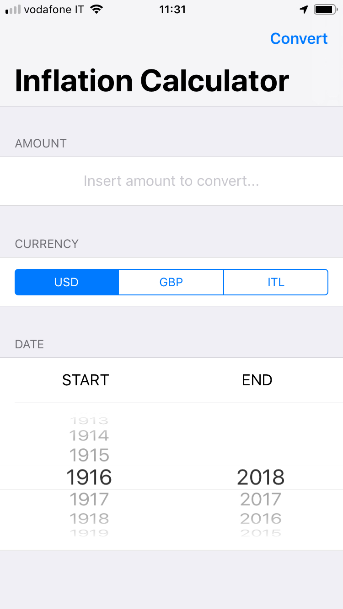
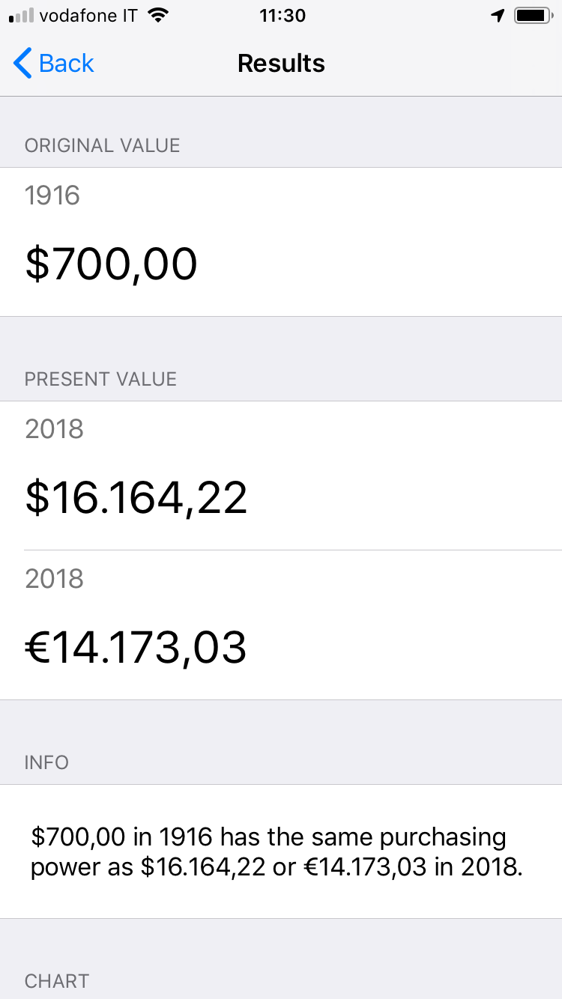
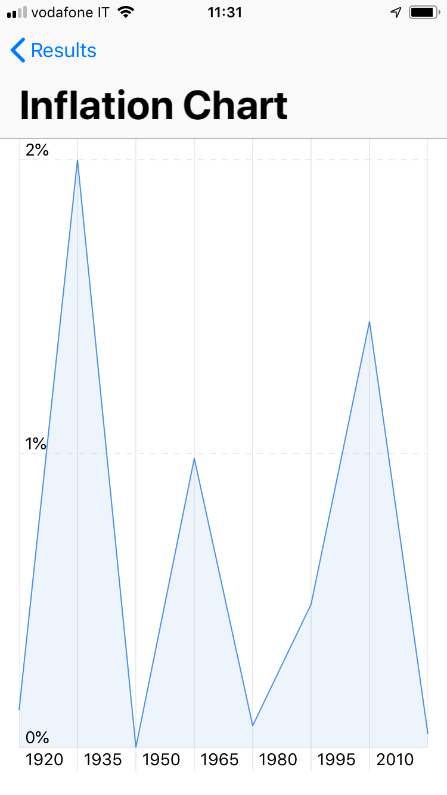

# **Inflation Calculator**

Permette di calcolare il potere di acquisto di dollaro, sterlina britannica e lira italiana nel corso dei secoli.

I tassi di inflazione storici sono presi da varie fonti e permettono di risalire al valore del dollaro a partire dal 1774, della sterlina a partire dal 1751 e della lira italiana a partire dal 1861.

Ad esempio, un hamburger da McDonald's in dollari del 1956 costava $0,15 , che corrispondono a €1,39 in valuta corrente.

  
   
  

